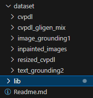

## Requirement
```
conda env create -f environment.yml
setting up datapath, like below
```



## How to use?

Image Generation
```
generate prompt by BLIP2.ipynb
generate image by GLIGEN.ipynb 
```

## Tutorial
### BLIP2
Input : train.json
Output : train_wpromt.json

Output format:
```
{
    "filename" : "IMG_2561_jpeg_jpg.rf.f50a9915e352436894ae2749e4df115a.jpg",,
    "creature" : "starfish"",
    "height" : "1024",
    "width" : "768",
    "bbox" : [
        [
            0.12,
            0.56,
            0.76,
            0.23
        ],
        ...
    ],
    "generated_caption" : "a starfish in an aquarium"
    "prompt_wtemp1" : "a starfish in an aquarium, creature: starfish"
    "prompt_wtemp2" : "a starfish in an aquarium, creature: starfish, height: 1024, width:768"
}
```

Workflow
1. Through train.json, read an image
2. Inference that image and get caption
3. Summary caption and templates
4. goto1, until no images remain

### GLIGEN
Input : train_wpromt.json
Output : image

Workflow
1. select 30 images metadata per category
2. Inference by GLIGEN and generate new images


### End-to-End DETR
conda activate detr

python main.py --dataset_path cvpdl/gligen_mix